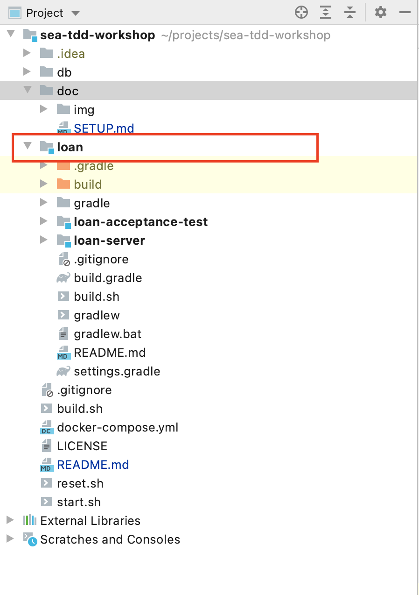

# Setup

## IntelliJ

### Import project
Run IntelliJ and `Open` project

Once it's done, make sure your project uses jvm version `11.x`

### Import gradle modules
Firstly open project structure (`⌘ ,` shortcut) and import `gradle` modules

select `build.gradle` file.

Make sure that *gradle wrapper* is selected and jvm version is `11.x`

Imported modules should be recognized by Intellij as modules

### Running the tests from IntelliJ
If you would like to run test by platform instead of gradle select `Build / Execution / Deployment` in preferences

